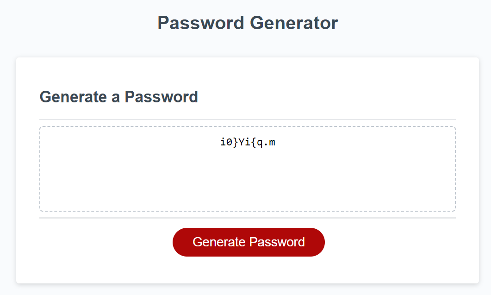

# HW3-JSpasswordGenerator

## Description

The goal of this assignment was to write a password generating function using Javascript! A base page to work from was provided here: 
https://github.com/coding-boot-camp/friendly-parakeet
From this, the password generating function was crafted and integrated into the page!

## Installation

No install required! This is simply a webpage that be accessed by going here:

## Usage

Visit the page via: 

Screenshot:

## Credits

Columbia Coding Bootcamp.

I would also like to thank the writer of this article who helped me realize that push could be used here!
https://bobbyhadz.com/blog/javascript-push-multiple-values-to-array

## License

MIT License

---
